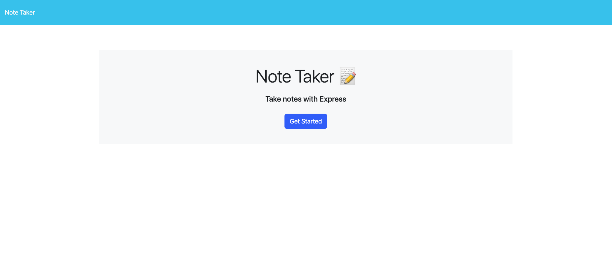
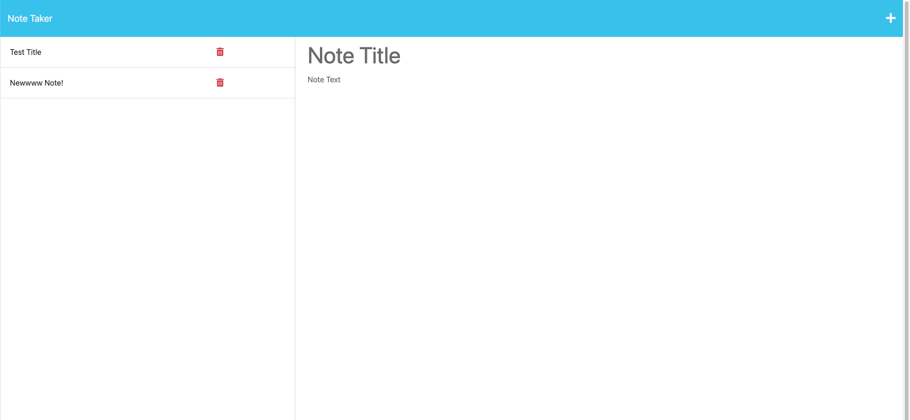

# note-taker

## In this application, I created the backend for a note-taking application. The user inputs a title, and then the note they'd like to remember. The application stores the note in a .json file so that the note can be recalled later. The user may also delete a note, by clicking the trash button. This is beneficial for someone with a busy schedule who wishes to store notes for later, and also delete notes as they see fit. 

Link: <a href="https://intense-earth-26195-5badd8721698.herokuapp.com/">Note Taker</a> 

## Installation

To install and run this application, follow these steps:

Clone the respository to your local machine using `git clone https://github.com/CoreyPhillipsOfficial/note-taker` 
Navigate to the project directory: `cd note-taking-app` 
Install the required packes using npm: `npm install` 
Start the application: `node server.js` 
Open your web browser and visit http://localhost:3000 to access the application 
Now you've successfully installed nd started the note-taking application! You can now create, save, and delete notes using the provided user interface.

## Usage

Open your web browser and visit http://localhost:3000 to access the note-taking application. 
To create a new note, type a title in the "Note Title" field, and the contents of the note in the "Note Text" field. 
Click the "save" icon in the upper-right hand corner to save your note. The note will be saved in the db.json file. 
To view a saved note, click on the note title n the list of notes on the left side of the application in the web browser. 
To delete a note, click on the trash button next to the note in the list of notes. The note will be removed from the application and from the db.json file. 
You can repeat the steps above to create, view, and delete multiple notes. 
You can now use the note-taking application to create and manage your notes!

## Credits

I receieved guidance on this application from my instructor, JD Tadlock in class. I also referred to ChatGPT to help me figure out where my syntax was incorrect. Rene Trevino also helped me understand the conepts used in this application during a tutoring session.

## License

Please refer to the LICENSE in the repo.